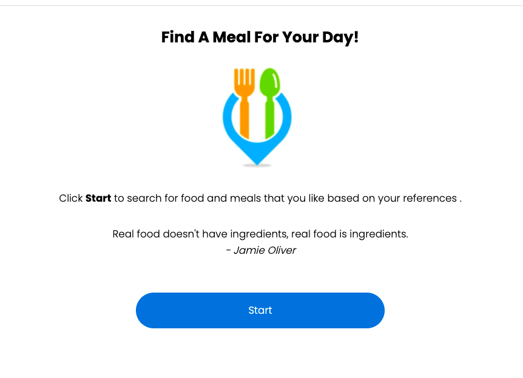
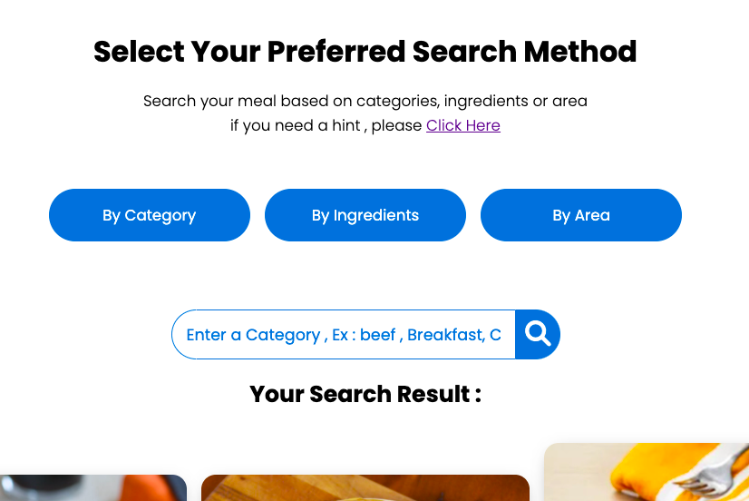
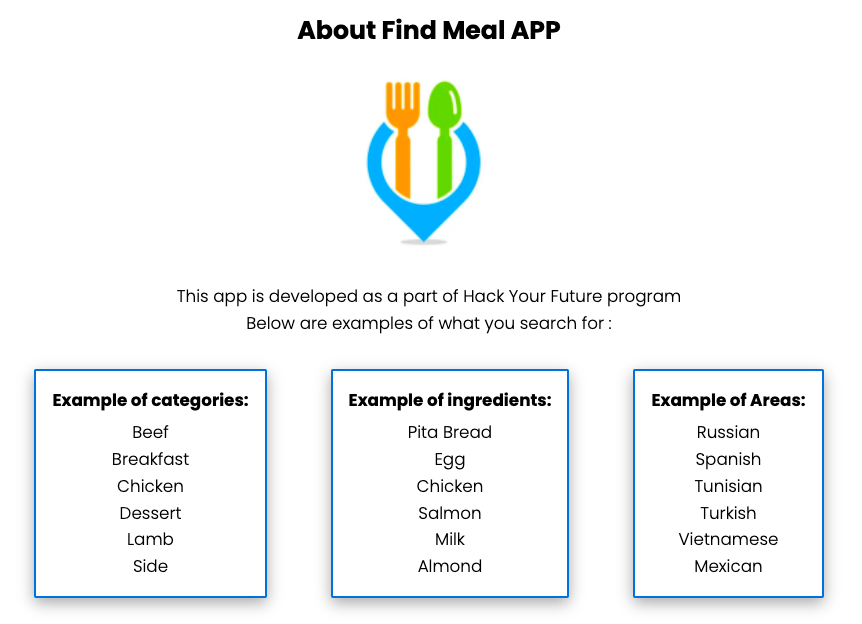
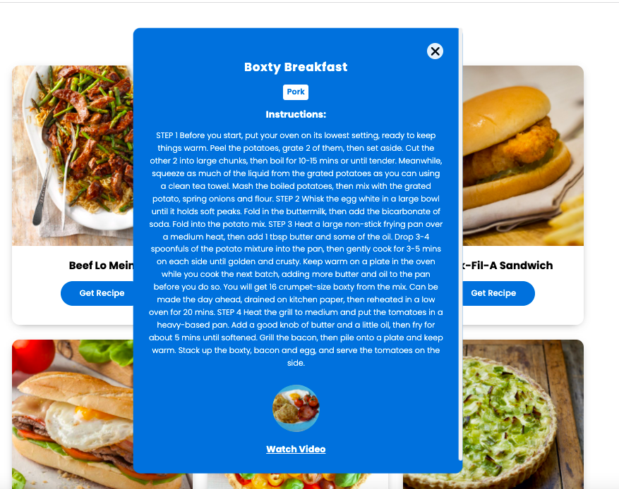

# Find Meal APP (vanilla JS)

Find-A-Meal is an application that allows customers to search food and meals they like based on their references .

## Description

We can find different type of meals like (Italian, Asian, French etc.)

- We can search meals based on categories ( Example : Seafood, Beef, Breakfast, etc )
- We can browse meals based on ingredients ( Example : Egg, Bread, Beans, etc )
- We can browse meals based on Area ( Example : American, Canadian, Dutch, etc )
- We can also get meals details such as name, Instructions, Youtube link.
- We can learn how to make different types of food.

## APP ScreenShots

### Home Page



### Search Page



### Result Page




### Detail Page



## Installing Dependencies

There are no dependencies needed to deploy the website, everything is prepared to work with vanilla JavaScript. However, to install the recommended ESLint and Prettier dependencies for use during development, issue the command:

```bash
npm install
```

### Folder Structure

```text
public
src
└── fetchers
└── lib
└── pages
└── views
└── app.js
└── constants.js
└── data.js
└── .secrets.js
index.html
```

## Built With

- HTML
- CSS
- Fontawesome
- JavaScript

## Live Demo

- URL: https://radhi-hudijan.github.io/Find-Meal-App-Router-Version-/index.html

## Developed By

#### 👤 **RADHI HUDIJAN**

- Github: [@Radhi-Hudijan](https://github.com/Radhi-Hudijan)
- Linkedin: [Radhi hudijan](https://linkedin.com/in/radhi-hudijan-094b8072)
- Email: radhif2009@gmail.com

## Mentored By

#### 👤 **Jim Cramer**

- Github: [@remarcmij](https://github.com/remarcmij)
